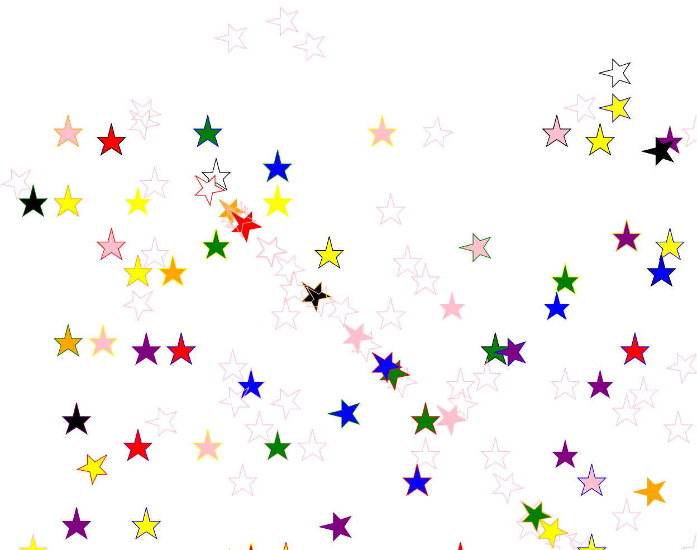

# SVG Art Generator

This project generates **SVG artwork in HTML** by reading object descriptions from text files, applying transformations, and exporting the result as `.html` files that can be opened in any web browser.

---

## 📌 Overview

The project is organized into several components:

- **`draw_svg.cpp`** – functions for converting geometric objects (circles, polygons, etc.) into SVG strings and exporting them into HTML files.
- **`getInfo.cpp`** – helper functions for reading user input (strings and integers).
- **`file.*`** – functions for parsing input text files and converting them into `composedObject` structures.
- **`object.*`** – definitions of geometric objects (`simpleObject`, `composedObject`).
- **`canvas.*`** – definition of the canvas (size, transformations, grid, etc.).
- **`test_draw_rand_tableau.cpp`** – test program that reads object files, applies transformations, and produces final SVG/HTML output.

---

## ⚙️ How it works

1. Input files (`.txt`) describe geometric objects (circles, polygons, etc.).
2. These files are parsed into `composedObject` structures.
3. The program creates a `Canvas` (drawing area).
4. Transformations are applied to the objects:
   - **Random transformations** (`initElemTransf_rand`)
   - **Vera transformations** (`initElemTransf_Vera_1a`, `initElemTransf_Vera_1b`)
5. The final result is exported as an **HTML file containing `<svg>`** markup.

Open the generated `.html` files in your browser to view the artwork.

---

## 🏗️ Build

This project comes with a `Makefile`, so you can build it easily by running:

```bash
make
```

---

## ▶️ Run

The test program requires **at least 6 arguments**:

```bash
./test_fonc3 argc file1.txt file2.txt file3.txt file4.txt file5.txt
```

- `file1.txt`, `file2.txt`, `file3.txt` → processed with **random transformations**
- `file4.txt` → processed with **Vera_1a transformation**
- `file5.txt` → processed with **Vera_1b transformation**

Output:  
- `test_rand_tableau_1.html`  
- `test_rand_tableau_2.html`  
- `test_rand_tableau_3.html`  
- `test_rand_tableau_4.html`  
- `test_rand_tableau_5.html`  

---

## 📂 Example

```bash
./test_fonc3 5 ../resources/Object1.txt ../resources/Object2.txt ../resources/Object3.txt ../resources/Vera_tableau_1a.txt ../resources/Vera_tableau_1b.txt
```

Then open `test_rand_tableau_*.html` in your browser.


(`test_rand_tableau_2.html` shown below was generated by the command above.)



---

## ✨ Features

- Export circles and polygons into valid SVG markup.
- Compose multiple objects into a single SVG drawing.
- Apply random and predefined grid-based transformations.
- Generate multiple SVG canvases at once.

---

## 📜 License

This project is provided for educational purposes. You are free to modify and adapt it.
